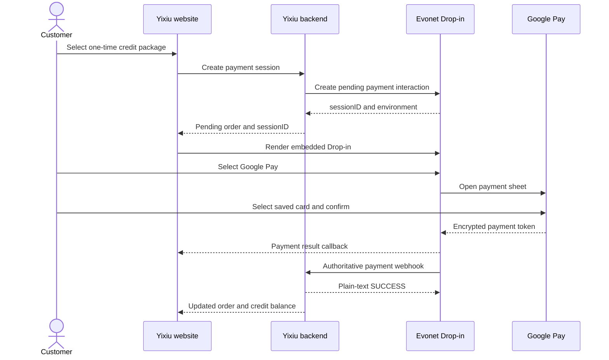

# Google Pay API Review Flow

## Submission profile

- Merchant legal name: `JADE ROUGE ENTERPRISES LIMITED`
- Product: `Yixiu` digital creator credits
- Website: `https://www.kaliai.fun`
- Checkout URL after sign-in: `https://www.kaliai.fun/app/?page=billing`
- Purchase type: one-time purchase of digital credits; no subscription and no physical shipping
- Integration: Evonet hosted Drop-in checkout
- Processing model: payment service provider / gateway-managed integration, not a merchant Direct API integration

Evonet states that Google Pay is available through Drop-in or LinkPay and that, for Drop-in integrations, Evonet registers the merchant in the Google Pay API Console. Evonet should therefore confirm and complete the Google Pay production configuration for this merchant. The merchant website does not directly initialize Google Pay, receive raw card data, or decrypt Google Pay payment tokens.

## Submission-ready checkout flow

The following English copy can be provided to Evonet or used as the payment-flow description during the Google Pay review:

> 1. The customer signs in to Yixiu and opens the Credits & Orders page on `https://www.kaliai.fun`.
> 2. The customer selects a one-time digital credit package. The package, number of credits, currency, and final USD price are displayed before checkout begins.
> 3. The Yixiu frontend requests a secure payment session from the Yixiu backend. The backend validates the customer and order, creates a pending order, and requests an Evonet Drop-in session. Only the Evonet session ID and environment are returned to the browser.
> 4. The Evonet Drop-in checkout is displayed as an embedded secure payment panel. The customer selects Google Pay from the available payment methods.
> 5. The Google Pay payment sheet opens and displays the eligible cards saved in the customer's Google Account. The customer selects a card and confirms the payment.
> 6. Google Pay securely returns an encrypted payment token to Evonet. Yixiu does not receive or store the customer's full card number, CVV, or the unencrypted Google Pay payment credential.
> 7. Evonet processes the payment and returns the result through the Drop-in checkout. Yixiu immediately displays the success, failure, cancellation, or incomplete-payment result to the customer.
> 8. For a successful payment, Evonet also sends an asynchronous webhook to the Yixiu backend. The verified webhook is the authoritative confirmation used to mark the order as paid and grant the purchased credits exactly once.
> 9. The customer sees the payment-success confirmation, refreshed credit balance, and order record. Failed, cancelled, or incomplete payments do not grant credits and can be retried.

## System flow

## Required review screenshots

Google's current web integration submission requires five screenshots of the real buyflow, each no larger than 1 MB:

1. **Item selection** — the Credits & Orders page showing the available one-time credit packages.
2. **Pre-purchase** — the selected package with the credit amount, currency, and final USD price visible immediately before checkout.
3. **Payment method** — the Evonet Drop-in payment panel showing Google Pay as an available payment method.
4. **Payment information** — the Google Pay payment sheet showing the customer's saved payment method before confirmation. If the device blocks screenshots, photograph the screen with another device.
5. **Post-purchase** — the Yixiu payment-success confirmation, updated credit balance, and successful order record.

Use PNG, JPEG, or WebP. Do not include test credentials, complete card numbers, CVV values, access tokens, API keys, or unrelated personal information in the images.

## Review and data-handling notes

- The final USD amount is shown before the customer opens Google Pay and is checked again against the backend-created order before the Drop-in is displayed.
- Google Pay is presented inside Evonet's payment selector with parity to other available payment methods.
- The website uses Google Pay information only to complete the current transaction. Card tokenization and payment processing are handled by Google Pay and Evonet.
- The merchant frontend callback is used for immediate customer feedback and reconciliation. Credits are granted only after the verified Evonet webhook confirms payment.
- A failed, cancelled, or incomplete payment leaves the order unpaid and does not grant credits.
- Because these are digital credits, no shipping address is requested.
- Customer sign-in is required so purchased credits can be assigned to the correct Yixiu account.

## References

- [Evonet Google Pay](https://developer.evonetonline.com/docs/google-pay)
- [Evonet Drop-in integration](https://developer.evonetonline.com/docs/drop-in-integration)
- [Google Pay web integration checklist](https://developers.google.com/pay/api/web/guides/test-and-deploy/integration-checklist)
- [Google Pay production publishing guide](https://developers.google.com/pay/api/web/guides/test-and-deploy/publish-your-integration)
- [Google Pay brand guidelines](https://developers.google.com/pay/api/web/guides/brand-guidelines)
